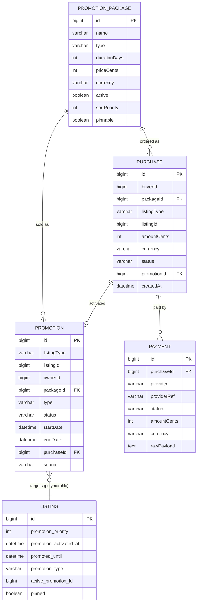
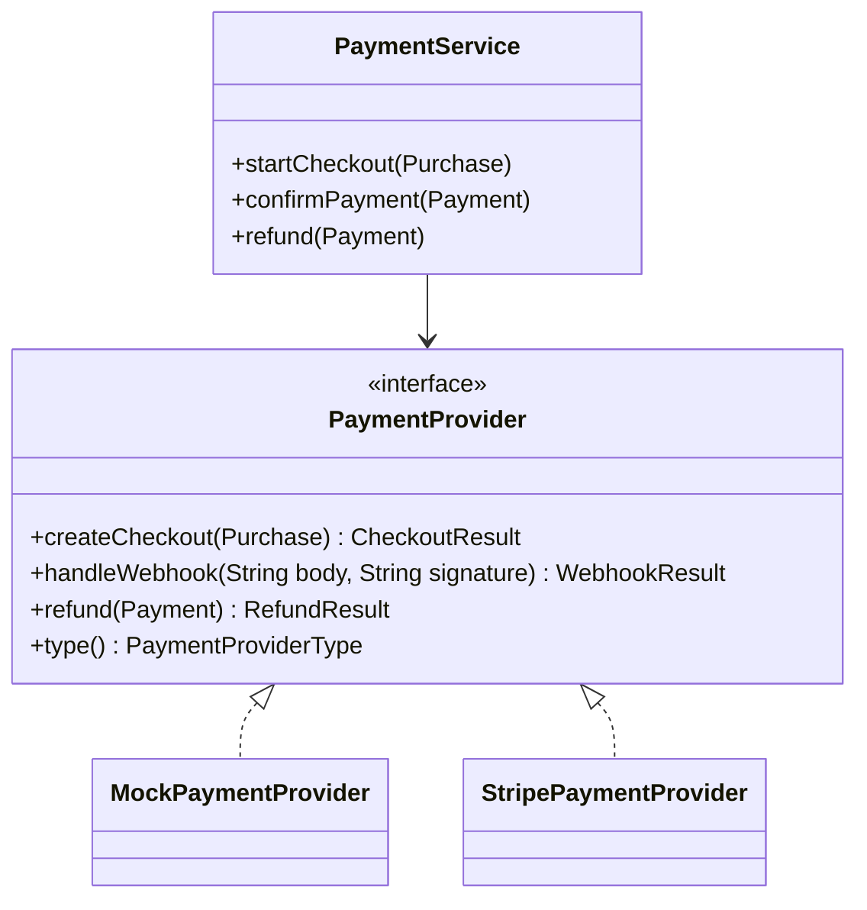
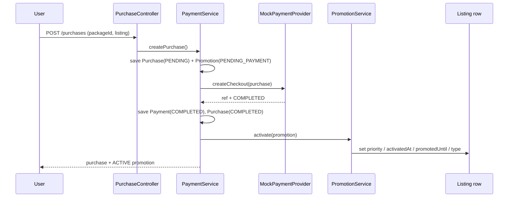
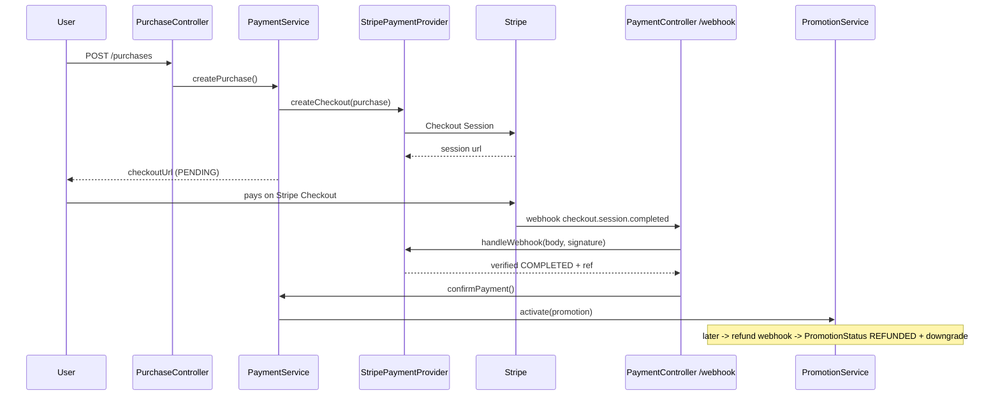
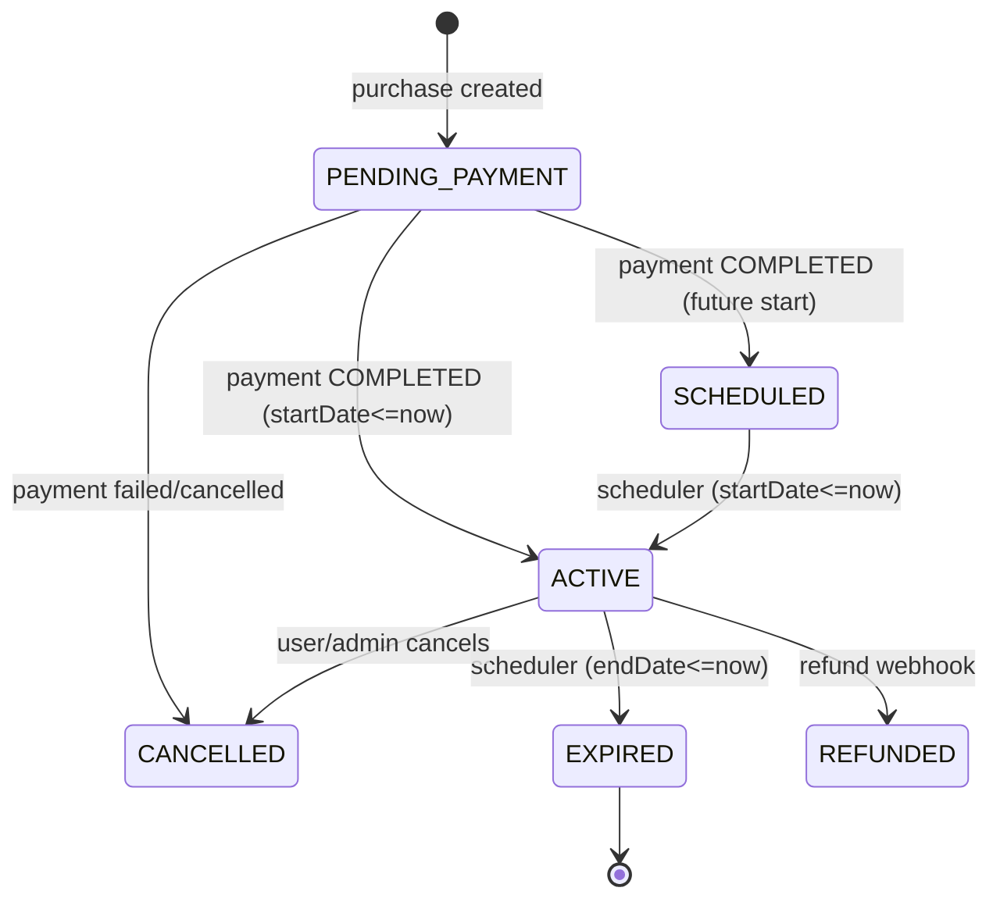

# Listing Visibility & Promotion System — Design

Production-oriented design for the Standard / Promoted / Featured listing tiers, the
payment-provider-agnostic monetization layer, the scheduled lifecycle job, and the
supporting UX. This document is the source of truth for the feature; the MVP
implementation in `sassedo-be` and `sassedo-fe` follows it directly.

- Backend: Spring Boot 4 / Java 17 / MySQL (Hibernate `ddl-auto=update`, no Flyway today)
- Frontend: Next.js 16 / React 19 / Tailwind v4 / shadcn/ui / Zustand / React Query
- Promotions are **polymorphic** across the three existing listing markets:
  `rental_listings`, `roommate_listings`, `apartment_searches`.

---

## 1. Business tiers

| Tier | Price | Visibility | Badge | Card style | Sort key |
| --- | --- | --- | --- | --- | --- |
| **Standard** | Free | After all paid | none | default | newest first (`created_at`) |
| **Promoted** | Paid | Before Standard | "Promoted" | default | newest active promotion, then newest listing |
| **Featured** | Paid | Before everything | "Featured" | highlighted (ring + soft bg), optional pin | newest active promotion, then newest listing |

Global order is always **Featured → Promoted → Standard**. Within a tier: newest active
promotion first, then newest listing. Expired promotions automatically downgrade the
listing back to Standard.

---

## 2. Data model

### 2.1 Entities

New backend module `server.sassedo.promotion`.

- **PromotionPackage** — an admin-configured, purchasable product.
  `id, name, description, type (PROMOTED|FEATURED), durationDays, priceCents, currency,
  active, sortPriority, pinnable, createdAt, updatedAt`.
- **Promotion** — the lifecycle + audit record for a single promotion of a single listing.
  `id, listingType (RENTAL|ROOMMATE|SEARCH), listingId, ownerId, packageId, type, status,
  startDate, endDate, purchaseId, source (PURCHASE|ADMIN_GRANT), createdAt, updatedAt`.
  **Never hard-deleted** — history is retained for auditing.
- **Purchase** — an order placed by a user for a package against a listing.
  `id, buyerId, packageId, listingType, listingId, amountCents, currency, status,
  promotionId, createdAt (= purchaseDate), updatedAt`.
- **Payment** — a single payment attempt against a purchase.
  `id, purchaseId, provider (MOCK|STRIPE), providerRef (checkout session / intent id),
  status, amountCents, currency, rawPayload, createdAt, updatedAt`.

### 2.2 Denormalized promotion state on listings (the scaling decision)

To sort millions of listings by tier **without joining the polymorphic `promotions`
table at read time**, each listing row carries an embedded `PromotionState`
(`@Embeddable`, reused by all three listing entities):

| Column | Type | Purpose |
| --- | --- | --- |
| `promotion_priority` | INT (default 0) | `0=STANDARD, 1=PROMOTED, 2=FEATURED`. Numeric so it sorts and indexes correctly (string enums would sort alphabetically wrong). |
| `promotion_activated_at` | DATETIME NULL | intra-tier ordering key (newest active promotion first). |
| `promoted_until` | DATETIME NULL | expiration timestamp / quick checks. |
| `promotion_type` | VARCHAR NULL | denormalized `PROMOTED`/`FEATURED` for the badge. |
| `active_promotion_id` | BIGINT NULL | pointer to the active `Promotion` row. |
| `pinned` | BOOLEAN | featured pin flag for category pages. |

The `promotions` table remains the source of truth; the activation logic and the
scheduler keep these columns in sync. This is a classic read-optimized denormalization:
writes are rare (buy/expire), reads are hot (every browse request).

### 2.3 ER diagram



### 2.4 Enums

All persisted `@Enumerated(EnumType.STRING)` per repo convention.

- `PromotionType { PROMOTED, FEATURED }`
- `PromotionStatus { PENDING_PAYMENT, SCHEDULED, ACTIVE, EXPIRED, CANCELLED, REFUNDED }`
- `PaymentProviderType { MOCK, STRIPE }`
- `PaymentStatus { PENDING, COMPLETED, FAILED, CANCELLED, REFUNDED }`
- `ListingType { RENTAL, ROOMMATE, SEARCH }`
- `PromotionSource { PURCHASE, ADMIN_GRANT }`

---

## 3. Reference SQL (MySQL)

The running app uses Hibernate `ddl-auto=update`, so these tables/columns are created
automatically. The DDL below is the reference schema and the migration you would ship
once Flyway is introduced (recommended before production — see §11).

```sql
CREATE TABLE promotion_packages (
    id            BIGINT AUTO_INCREMENT PRIMARY KEY,
    name          VARCHAR(120) NOT NULL,
    description   VARCHAR(500),
    type          VARCHAR(20)  NOT NULL,           -- PROMOTED | FEATURED
    duration_days INT          NOT NULL,
    price_cents   INT          NOT NULL,
    currency      VARCHAR(3)   NOT NULL DEFAULT 'EUR',
    active        BOOLEAN      NOT NULL DEFAULT TRUE,
    sort_priority INT          NOT NULL DEFAULT 0, -- admin ordering of packages
    pinnable      BOOLEAN      NOT NULL DEFAULT FALSE,
    created_at    DATETIME     NOT NULL,
    updated_at    DATETIME,
    CONSTRAINT chk_pkg_price CHECK (price_cents >= 0),
    CONSTRAINT chk_pkg_duration CHECK (duration_days > 0)
);

CREATE TABLE promotions (
    id             BIGINT AUTO_INCREMENT PRIMARY KEY,
    listing_type   VARCHAR(20)  NOT NULL,          -- RENTAL | ROOMMATE | SEARCH
    listing_id     BIGINT       NOT NULL,
    owner_id       BIGINT       NOT NULL,
    package_id     BIGINT,
    type           VARCHAR(20)  NOT NULL,
    status         VARCHAR(20)  NOT NULL,
    source         VARCHAR(20)  NOT NULL DEFAULT 'PURCHASE',
    start_date     DATETIME,
    end_date       DATETIME,
    purchase_id    BIGINT,
    created_at     DATETIME     NOT NULL,
    updated_at     DATETIME,
    CONSTRAINT fk_promo_package  FOREIGN KEY (package_id)  REFERENCES promotion_packages(id),
    CONSTRAINT fk_promo_purchase FOREIGN KEY (purchase_id) REFERENCES purchases(id)
);

CREATE TABLE purchases (
    id           BIGINT AUTO_INCREMENT PRIMARY KEY,
    buyer_id     BIGINT      NOT NULL,
    package_id   BIGINT      NOT NULL,
    listing_type VARCHAR(20) NOT NULL,
    listing_id   BIGINT      NOT NULL,
    amount_cents INT         NOT NULL,
    currency     VARCHAR(3)  NOT NULL DEFAULT 'EUR',
    status       VARCHAR(20) NOT NULL,             -- mirrors PaymentStatus
    promotion_id BIGINT,
    created_at   DATETIME    NOT NULL,
    updated_at   DATETIME,
    CONSTRAINT fk_purchase_package FOREIGN KEY (package_id) REFERENCES promotion_packages(id)
);

CREATE TABLE payments (
    id           BIGINT AUTO_INCREMENT PRIMARY KEY,
    purchase_id  BIGINT      NOT NULL,
    provider     VARCHAR(20) NOT NULL,             -- MOCK | STRIPE
    provider_ref VARCHAR(255),                     -- checkout session / payment intent id
    status       VARCHAR(20) NOT NULL,
    amount_cents INT         NOT NULL,
    currency     VARCHAR(3)  NOT NULL DEFAULT 'EUR',
    raw_payload  TEXT,
    created_at   DATETIME    NOT NULL,
    updated_at   DATETIME,
    CONSTRAINT fk_payment_purchase FOREIGN KEY (purchase_id) REFERENCES purchases(id)
);

-- Denormalized columns added to EACH of the three listing tables
ALTER TABLE rental_listings
    ADD COLUMN promotion_priority     INT NOT NULL DEFAULT 0,
    ADD COLUMN promotion_activated_at DATETIME NULL,
    ADD COLUMN promoted_until         DATETIME NULL,
    ADD COLUMN promotion_type         VARCHAR(20) NULL,
    ADD COLUMN active_promotion_id    BIGINT NULL,
    ADD COLUMN pinned                 BOOLEAN NOT NULL DEFAULT FALSE;
-- (identical ALTER for roommate_listings and apartment_searches)
```

### 3.1 Indexes

```sql
-- The hot browse path: filter by status, then order by tier priority.
CREATE INDEX idx_rental_browse
    ON rental_listings (status, promotion_priority, promotion_activated_at, created_at);
CREATE INDEX idx_roommate_browse
    ON roommate_listings (status, promotion_priority, promotion_activated_at, created_at);
CREATE INDEX idx_search_browse
    ON apartment_searches (status, promotion_priority, promotion_activated_at, created_at);

-- Scheduler / lookups on the promotions table.
CREATE INDEX idx_promo_status_end   ON promotions (status, end_date);
CREATE INDEX idx_promo_status_start ON promotions (status, start_date);
CREATE INDEX idx_promo_listing      ON promotions (listing_type, listing_id);
CREATE INDEX idx_promo_owner        ON promotions (owner_id);

CREATE INDEX idx_purchase_buyer     ON purchases (buyer_id, created_at);
CREATE INDEX idx_payment_purchase   ON payments (purchase_id);
CREATE INDEX idx_payment_ref        ON payments (provider, provider_ref);
```

Because the browse index leads with `(status, promotion_priority, promotion_activated_at,
created_at)`, the query `WHERE status = 'ACTIVE' ORDER BY promotion_priority DESC,
promotion_activated_at DESC, created_at DESC` is index-satisfiable and paginates in
`O(log n + page_size)` regardless of table size. City/property-type filters narrow the
result set but do not change the ordering.

---

## 4. REST API

Base URL `/api`. Auth via `Authorization: Bearer <jwt>` (existing). Admin endpoints use
the `/admin/...` path segment, auto-protected by the existing
`/api/.*/admin.*` → `ROLE_ADMIN` rule. Business errors return `400` with
`{ "code": "...", "message": "..." }` (repo convention).

### 4.1 Promotion Packages

```
GET  /api/promotion-packages                 (public) active packages
GET  /api/promotion-packages/admin/all       (admin)  all packages
POST /api/promotion-packages/admin           (admin)  create
PUT  /api/promotion-packages/admin/{id}      (admin)  update (price, duration, active, order, pinnable)
DELETE /api/promotion-packages/admin/{id}    (admin)  deactivate (soft)
```

```json
// POST /api/promotion-packages/admin
{ "name": "Featured 14 days", "type": "FEATURED", "durationDays": 14,
  "priceCents": 2999, "currency": "EUR", "sortPriority": 20, "pinnable": true }

// 200 OK
{ "id": 6, "name": "Featured 14 days", "type": "FEATURED", "durationDays": 14,
  "priceCents": 2999, "currency": "EUR", "active": true, "sortPriority": 20,
  "pinnable": true }
```

### 4.2 Purchases (the "Promote" action)

```
POST /api/purchases              create purchase -> (mock) pay -> activate promotion
GET  /api/purchases/mine         current user's purchases
GET  /api/purchases/admin/all    (admin) all purchases (paged)
```

```json
// POST /api/purchases
{ "packageId": 3, "listingType": "RENTAL", "listingId": 42 }

// 200 OK  (MVP mock provider auto-completes payment)
{ "purchaseId": 10, "status": "COMPLETED", "checkoutUrl": "mock://checkout/10",
  "payment": { "id": 15, "provider": "MOCK", "status": "COMPLETED" },
  "promotion": { "id": 7, "type": "FEATURED", "status": "ACTIVE",
    "listingType": "RENTAL", "listingId": 42,
    "startDate": "2026-07-06T09:00:00", "endDate": "2026-07-20T09:00:00" } }
```

Under Stripe (future), the same call returns `status: "PENDING"` and a real
`checkoutUrl`; the promotion is created `PENDING_PAYMENT` and only activated by the
webhook (see §6).

### 4.3 Promotions

```
GET   /api/promotions/mine                        current user's promotions (active + history)
POST  /api/promotions/{id}/cancel                 cancel own active/scheduled promotion
GET   /api/promotions/admin/all                   (admin) all promotions (paged, filters)
POST  /api/promotions/admin/grant                 (admin) manually upgrade a listing
POST  /api/promotions/admin/{id}/remove           (admin) manually remove a promotion
```

```json
// POST /api/promotions/admin/grant
{ "listingType": "ROOMMATE", "listingId": 88, "type": "PROMOTED", "durationDays": 30 }

// 200 OK
{ "id": 21, "type": "PROMOTED", "status": "ACTIVE", "source": "ADMIN_GRANT",
  "listingType": "ROOMMATE", "listingId": 88,
  "startDate": "2026-07-06T09:00:00", "endDate": "2026-08-05T09:00:00" }
```

### 4.4 Payments

```
POST /api/payments/webhook/{provider}   (public) provider webhook sink (Stripe-ready)
GET  /api/payments/mine                 current user's payment history
GET  /api/payments/admin/all            (admin) all payments (paged)
```

---

## 5. Payment abstraction (Stripe-ready)



- `PaymentProvider` is the seam. Everything above it (PurchaseService, PromotionService,
  scheduler) is provider-agnostic and never references Stripe types.
- `MockPaymentProvider` is the only bean wired in the MVP (`@ConditionalOnProperty
  sassedo.payments.provider=mock`, the default). It returns a fake `checkoutUrl`/ref and
  reports the payment `COMPLETED` immediately so promotions activate end-to-end without a
  real gateway.
- `StripePaymentProvider` ships as a documented stub (no Stripe SDK dependency added yet)
  with TODOs for Checkout Sessions, Payment Intents, webhook signature verification, and
  refunds. Switching to Stripe = add the SDK, implement the stub, set
  `sassedo.payments.provider=stripe`. **No changes to the promotion system.**
- `PaymentService` orchestrates: create `Purchase` + `Payment (PENDING)` → provider
  `createCheckout` → on `COMPLETED` (mock now, webhook later) → activate the `Promotion`
  and write the denormalized listing columns.

### 5.1 Current MVP payment flow



### 5.2 Future Stripe payment flow



Invoice history (future): each `checkout.session.completed` carries a Stripe invoice /
receipt URL; store it on `Payment.rawPayload` (or a dedicated column) and surface it in
the dashboard payment history.

---

## 6. Scheduled lifecycle job

`@EnableScheduling` is added to the app. `PromotionScheduler.sweep()` runs every ~60s
(`fixedDelayString`, configurable via `sassedo.promotions.sweep-ms`) and is idempotent:

1. **Activate** — `Promotion` rows in `SCHEDULED` whose `startDate <= now` become
   `ACTIVE`; write the listing's denormalized columns.
2. **Expire** — `Promotion` rows in `ACTIVE` whose `endDate <= now` become `EXPIRED`;
   reset that listing's denormalized columns to Standard (`priority=0`, null timestamps).



---

## 7. Search results UX — recommendation

Two options were considered:

**A. Hard sections** ("Featured", "Promoted", "Standard" headers, each with its own list).

**B. Single auto-sorted list** (backend returns Featured → Promoted → Standard already
ordered; Featured cards are visually distinct; an optional Featured strip/carousel is
shown only on page 1).

**Recommendation: B — a single auto-sorted list, with a Featured strip on page 1.**

Why B wins for a marketplace at scale:

- **Pagination integrity.** With hard sections, each section needs its own pagination and
  the tiers fragment across pages ("page 2 of Featured" vs "page 2 of everything"). A
  single list maps 1:1 to the single indexed SQL query and paginates cleanly while always
  preserving the Featured → Promoted → Standard order (a core business rule).
- **Free listings stay discoverable and fair.** In a single ordered list, Standard
  listings always render on the page — just lower. Hard sections risk pushing the entire
  Standard section "below the fold" or onto later pages, which erodes trust and the free
  supply that makes the marketplace liquid.
- **One query, one source of truth.** The list order is exactly the DB order, so filters
  and pagination can never accidentally reorder tiers. Sections would require 3 queries
  and client-side stitching.
- **Conversion.** A distinct Featured card + a page-1 Featured strip gives paid listings
  the visibility they paid for without hiding the organic inventory, which keeps sellers
  buying (they can see the uplift) and buyers browsing (they still find good free stock).

Hard sections are only preferable on curated landing pages with tiny inventories; they are
documented here as the rejected alternative for the main search results.

---

## 8. UX wireframes

Low/high-fidelity ASCII wireframes. Featured = highlighted card (ring + soft brand-green
background), Promoted = default card + amber "Promoted" badge.

### 8.1 Home page

```
+------------------------------------------------------------------+
|  [logo]        Find apartment  Find roommate  Find tenant  [👤]  |
+------------------------------------------------------------------+
|         Hero: "Find your next home"   [ Search ▸ ]               |
+------------------------------------------------------------------+
|  ★ Featured near you                                    (strip)  |
|  +----------+  +----------+  +----------+  +----------+           |
|  |★FEATURED |  |★FEATURED |  |★FEATURED |  |★FEATURED |  ▸        |
|  | img      |  | img      |  | img      |  | img      |           |
|  | €650  ♥  |  | €700  ♥  |  | €540  ♥  |  | €820  ♥  |           |
|  +----------+  +----------+  +----------+  +----------+           |
+------------------------------------------------------------------+
|  Popular cities  [Sofia] [Plovdiv] [Varna] ...                   |
+------------------------------------------------------------------+
```

### 8.2 Search results (single auto-sorted list — recommended)

```
+------------------------------------------------------------------+
|  Filters: [City ▾] [Type ▾] [Clear]              123 results     |
+------------------------------------------------------------------+
|  ★ Featured (page 1 strip)                                       |
|  +----------+  +----------+  +----------+                        |
|  |★FEATURED |  |★FEATURED |  |★FEATURED |   ▸                    |
|  +----------+  +----------+  +----------+                        |
+------------------------------------------------------------------+
|  Grid (already ordered Featured → Promoted → Standard):          |
|  +===========+   +-----------+   +-----------+                   |
|  |★ FEATURED |   |  Promoted |   |  Promoted |   <- badges       |
|  | ring+bg ♥ |   |  img    ♥ |   |  img    ♥ |                   |
|  | €900      |   |  €650     |   |  €610     |                   |
|  +===========+   +-----------+   +-----------+                   |
|  +-----------+   +-----------+   +-----------+                   |
|  | Standard  |   | Standard  |   | Standard  |                   |
|  | img     ♥ |   | img     ♥ |   | img     ♥ |                   |
|  +-----------+   +-----------+   +-----------+                   |
|                   [ Prev ]  Page 1 / 11  [ Next ]                |
+------------------------------------------------------------------+
```

### 8.3 Listing details

```
+------------------------------------------------------------------+
|  < Back        [★ FEATURED]                              ♥ Save  |
|  +--------------------------+   Title: Cozy 2BR near center       |
|  |        gallery           |   €900 / month                      |
|  |                          |   📍 Sofia, Lozenets                 |
|  +--------------------------+   Published: 6 Jul 2026             |
|  Amenities · Lease terms · Description ...                        |
|  [ Contact owner ]                                                |
+------------------------------------------------------------------+
| (owner view adds:)  [ Promote this listing ▸ ]                   |
+------------------------------------------------------------------+
```

### 8.4 User dashboard — My listings & promotions

```
+------------------------------------------------------------------+
|  Dashboard   Profile | Listings | Promotions | Settings          |
+------------------------------------------------------------------+
|  Active promotions                                               |
|  +------------------------------------------------------------+  |
|  | ★ Featured  · Cozy 2BR      12 days left   [Renew][Cancel] |  |
|  |   Promoted  · Studio A       3 days left   [Renew][Cancel] |  |
|  +------------------------------------------------------------+  |
|  Promotion history            Purchase history   Payment history |
|  | EXPIRED Featured 14d ... |  | #10 €29.99 ... | | MOCK ✓ ... | |
+------------------------------------------------------------------+
```

### 8.5 Promote listing dialog

```
+---------------------- Promote "Cozy 2BR" ----------------------+
|  ( ) Promoted   Shown above standard listings                  |
|      [ 7 days €4.99 ] [ 14 days €8.99 ] [ 30 days €14.99 ]      |
|  (•) Featured   Top of every list + highlighted card           |
|      [ 7 days €14.99 ] [ 14 days €24.99 ] [ 30 days €39.99 ]    |
|                                                                |
|  Selected: Featured · 14 days · €24.99                         |
|  [ Cancel ]                          [ Pay & activate ▸ ]      |
|  (MVP: mock payment — promotion activates immediately)         |
+----------------------------------------------------------------+
```

### 8.6 Payment flow (future Stripe)

```
Promote dialog ──▶ [Pay & activate]
        │  (MVP: mock → activated immediately, toast "Promotion active")
        └─(future)─▶ Stripe Checkout (hosted) ─▶ success_url
                          │                          │
                          ▼                          ▼
                 webhook completed          /dashboard/promotions
                          │                  "Activating…" → ACTIVE
                          ▼
                 promotion ACTIVE
```

### 8.7 Admin promotion management

```
+------------------------------------------------------------------+
|  Admin   Users | Countries | Listings | Promotions               |
+------------------------------------------------------------------+
|  [ Packages ] [ Promotions ] [ Purchases ] [ Payments ]          |
|  --- Packages -------------------------------------------------- |
|  Name              Type      Dur  Price   Order  Active  [Edit]  |
|  Promoted 7 days   PROMOTED   7   €4.99    10     ✓      [·][x]  |
|  Featured 14 days  FEATURED  14  €24.99    20     ✓      [·][x]  |
|  [ + New package ]                                               |
|  --- Promotions ------------------------------------------------ |
|  #21 ROOMMATE 88  FEATURED ACTIVE  ends 5 Aug  [Grant][Remove]  |
+------------------------------------------------------------------+
```

Every screen keeps free listings visible and gives owners a one-click upgrade path, which
maximizes conversion (clear value framing, remaining-days urgency, renew nudges) while
preserving a fair, discoverable free tier.

---

## 9. Business rules mapping

| Rule | Where enforced |
| --- | --- |
| Only one active promotion per listing | `PromotionService` checks for an existing `ACTIVE`/`SCHEDULED`/`PENDING_PAYMENT` promotion before creating a new one. |
| Featured > Promoted | numeric `promotion_priority` (2 vs 1). |
| Promotions have start/end dates | `Promotion.startDate/endDate`, derived from package `durationDays`. |
| Expired promotions auto-downgrade | `PromotionScheduler` expire step resets denormalized columns. |
| Filters don't change priority | single indexed `ORDER BY` independent of filter predicates. |
| Pagination preserves priority | DB-level ordering + paging on the same query. |
| Status updates via scheduled job | `PromotionScheduler.sweep()`. |
| History retained | `Promotion` rows are never deleted; status transitions only. |
| Payment confirmation before activation | activation only on `PaymentStatus.COMPLETED`. |
| Payment layer replaceable | `PaymentProvider` seam + `@ConditionalOnProperty`. |

---

## 10. Frontend architecture

- `lib/api/{promotion-packages,promotions,purchases,payments}.ts` — typed API functions
  mirroring `lib/api/rental-listings.ts`.
- `hooks/use-{promotion-packages,promotions,purchases}.ts` — React Query hooks.
- The three listing types gain `promotionTier`, `isFeatured`, `isPromoted`,
  `promotedUntil`, `pinned`.
- `components/listings/promotion-badge.tsx` + `favorite-button.tsx` (localStorage stub —
  there is no favorites backend yet).
- Cards render badge, publish date, favorite, and a highlighted Featured style using the
  existing `--brand-*` tokens.
- `components/listings/promote-listing-dialog.tsx` drives the MVP purchase flow.
- `app/dashboard/promotions/page.tsx` and `app/admin/promotions/page.tsx` for the two
  management surfaces. New shadcn primitives: `tabs`, `sonner`, `radio-group`.
- i18n keys under a `promotions.*` namespace in `messages/bg.json` + `messages/en.json`.

---

## 11. Production notes / known stubs

- **Flyway/Liquibase** is not in the project; schema currently evolves via Hibernate
  `ddl-auto=update`. Introduce Flyway and ship §3 as the first versioned migration before
  going to production.
- **Favorites** are a client-side localStorage stub; a real backend `favorites` table +
  API is a follow-up.
- **Invoices** are represented via `Payment.rawPayload`; a dedicated invoice/receipt
  surface arrives with the Stripe integration.
- **Stripe** provider is a stub; no secrets or SDK are added yet.
